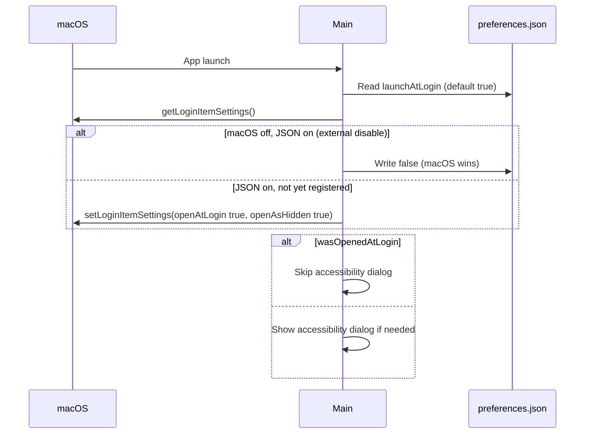
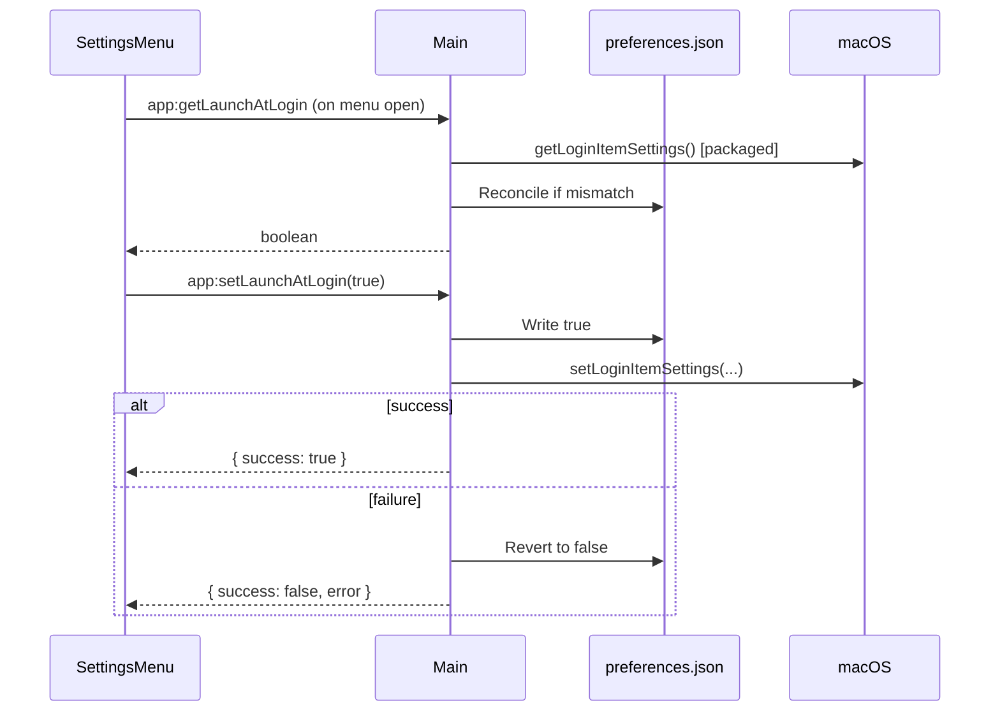

# Launch at Login - Implementation Plan

**Created**: 2026-06-24
**Status**: Planning
**Estimated Effort**: Small-Medium

## Overview

Add a user preference to start Clipboard Manager automatically when macOS boots. The app should launch silently in the background (tray only, no window), consistent with its existing `LSUIElement` / background-agent behavior.

## Goals

- Register the packaged app as a macOS login item when the preference is enabled
- Expose a toggle in the footer settings dropdown (default ON)
- Persist the preference in `userData` and stay in sync with macOS Login Items
- Defer the Accessibility permission dialog when the app is opened at login

## Non-Goals (Out of Scope)

- Tray menu toggle (footer settings dropdown only for v1)
- SQLite settings table (use JSON file instead)
- Launch-at-login in development builds (packaged app only for `setLoginItemSettings`)
- One-time upgrade notice when enabling for existing users (silent enable)

---

## Design Decisions

| Decision               | Choice                                                                                 |
| ---------------------- | -------------------------------------------------------------------------------------- |
| Control model          | Toggle in settings, **default ON**                                                     |
| UI location            | **Footer settings dropdown** only                                                      |
| Persistence            | **`preferences.json`** in `userData`                                                   |
| Login behavior         | **Silent** — `openAsHidden: true`, tray only                                           |
| Scope                  | **Packaged app only** for `setLoginItemSettings`                                       |
| Conflict resolution    | **macOS wins** — sync JSON down if Login Items disabled externally                     |
| Settings refresh       | **Re-check on menu open** (packaged only)                                              |
| Dev behavior           | Toggle **works in dev** (JSON only, no login item registration)                        |
| Accessibility at login | **Defer** when `wasOpenedAtLogin`; prompt on **first window show or first auto-paste** |
| Registration failure   | **Revert toggle + show user-visible error**                                            |
| Existing user upgrade  | **Silent** enable on first packaged launch after update                                |

---

## Implementation Phases

### Phase 1: Main-Process Preferences + Login Item Sync

**Files to create/modify:**

- `electron/lib/preferences.ts` (new)
- `electron/lib/launch-at-login.ts` (new)
- `electron/main.ts` (modify)

#### 1.1 Preferences module

Create `electron/lib/preferences.ts`:

- Read/write `{ launchAtLogin: boolean }` to `path.join(app.getPath("userData"), "preferences.json")`
- Default `launchAtLogin: true` when file is missing
- Pure read/write helpers suitable for unit testing

#### 1.2 Launch-at-login module

Create `electron/lib/launch-at-login.ts`:

- `syncLaunchAtLogin(enabled: boolean)` — when `app.isPackaged`: call `app.setLoginItemSettings({ openAtLogin: enabled, openAsHidden: true })`; no-op in dev
- `getEffectiveLaunchAtLogin()` — packaged: return `app.getLoginItemSettings().openAtLogin`; dev: return value from JSON
- `reconcileOnStartup()` — packaged only:
  - Read JSON preference (default true)
  - Read `app.getLoginItemSettings().openAtLogin`
  - If macOS says off but user disabled in System Settings → **update JSON to false** (macOS wins)
  - If JSON says on and login item not yet registered → call `setLoginItemSettings`
- `reconcileOnSettingsOpen()` — same macOS-wins logic when settings menu is opened (packaged only)
- `setLaunchAtLogin(enabled: boolean)` — write JSON, sync to macOS (packaged); on failure revert JSON and return error

#### 1.3 Startup integration

In `electron/main.ts`, call `reconcileOnStartup()` early in `app.whenReady()` (after DB init, before window creation).

---

### Phase 2: IPC + Preload

**Files to modify:**

- `electron/main.ts`
- `electron/preload.ts`
- `src/types/electron.d.ts` (if present)

#### 2.1 IPC handlers

- `app:getLaunchAtLogin` — call `reconcileOnSettingsOpen()` when packaged, return effective boolean
- `app:setLaunchAtLogin(enabled: boolean)` — call `setLaunchAtLogin(enabled)`; return `{ success: boolean; error?: string }`

#### 2.2 Preload bridge

Extend `window.electronAPI.app`:

```typescript
app: {
  quit: () => Promise<void>;
  getLaunchAtLogin: () => Promise<boolean>;
  setLaunchAtLogin: (enabled: boolean) => Promise<{ success: boolean; error?: string }>;
}
```

---

### Phase 3: Settings UI

**Files to modify:**

- `src/components/common/SettingsMenu.tsx`
- `src/components/common/SettingsMenu.test.tsx`
- `src/App.tsx` (wire toggle handler + error state)

#### 3.1 Toggle UI

Add a checkbox-style menu item to `SettingsMenu`: **"Launch at login"**

- On settings cog click: fetch current state via `app:getLaunchAtLogin`
- On toggle: call `app:setLaunchAtLogin`
- On failure: revert checkbox and surface error via existing `ErrorBanner` (or inline near toggle — see unresolved questions)
- Menu stays open after toggling (standard checkbox menu behavior)

---

### Phase 4: Deferred Accessibility Prompt

**Files to modify:**

- `electron/main.ts`
- Window show path (`windowModule.show()`)
- Hide-and-paste path (`windowHandlers.hideAndPaste`)

#### 4.1 Extract prompt helper

Extract the Accessibility dialog block (~lines 596–617 in `main.ts`) into `promptAccessibilityIfNeeded()`.

#### 4.2 Defer on login launch

- On startup: skip prompt when `app.getLoginItemSettings().wasOpenedAtLogin === true`
- Otherwise: show prompt as today (non-login launches)
- Track a session flag `accessibilityPromptShown` to avoid duplicate prompts

#### 4.3 Deferred trigger

Call `promptAccessibilityIfNeeded()` from:

- `windowModule.show()` (Cmd+Shift+V, tray Open)
- Hide-and-paste handler

Whichever happens first after a login launch triggers the one-time prompt.

---

### Phase 5: Tests + Documentation

**Files to create/modify:**

- `electron/lib/preferences.test.ts` (new)
- `electron/lib/launch-at-login.test.ts` (new)
- `src/components/common/SettingsMenu.test.tsx` (modify)
- `.docs/CURRENT_STATE.md`
- `.docs/FEATURES.md`

#### 5.1 Test coverage

- Preferences: default when missing, read/write, round-trip
- Launch-at-login: reconciliation logic (macOS wins), packaged vs dev gating (mock `app.isPackaged`)
- SettingsMenu: toggle renders, fetches state on open, calls IPC on change

---

## Startup Flow (Packaged)



---

## Settings Toggle Flow



---

## Unresolved Questions

1. **Error placement** — Use existing `ErrorBanner` at the top of the window, or a small inline message near the settings toggle?
2. **Tray menu later?** — Dropdown-only for v1; add tray parity in a follow-up?
3. **Phase scope** — Implement all five phases at once, or stop after Phase 3 (core feature) and defer accessibility + tests?

---

## References

- Electron API: [`app.setLoginItemSettings`](https://www.electronjs.org/docs/latest/api/app#appsetloginitemsettingssettings-macos-windows)
- Existing settings UI: `src/components/common/SettingsMenu.tsx`
- App startup: `electron/main.ts` (`app.whenReady()`)
- Builder config (`LSUIElement: true`): `electron-builder.yml`
