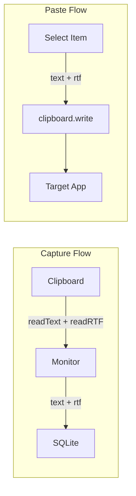

# RTF Clipboard Support

## Architecture



## Phase 1: Database Migration

Add nullable `rtf` column to store RTF data alongside plain text.

**File:** [electron/migrations/003_add_rtf.sql](electron/migrations/003_add_rtf.sql) (new)

```sql
ALTER TABLE history ADD COLUMN rtf TEXT;
```

---

## Phase 2: Main Process Changes

**File:** [electron/main.ts](electron/main.ts)

- Update `HistoryRow` type: add `rtf: string | null`
- Update `buildHistoryQuery` to SELECT `rtf` column
- Update `createClipboardHandlers`:
  - Add `read` that returns `{ text, rtf }` (both formats at once)
  - Change `writeText` → `write({ text, rtf? })` using `clipboard.write()`
- Update `addClip` handler: accept `{ text, rtf? }`, store both

Key snippet for write:

```typescript
write: (_event, data: { text: string; rtf?: string }) => {
  clipboard.write({ text: data.text, rtf: data.rtf || undefined });
}
```

---

## Phase 3: Preload & Types

**File:** [electron/preload.ts](electron/preload.ts)

- Update `clipboard.readText` → `clipboard.read` returning `{ text, rtf }`
- Update `clipboard.writeText` → `clipboard.write` accepting `{ text, rtf? }`
- Update `db.addClip` signature: `(data: { text: string; rtf?: string })`
- Update `db.getHistory` return type to include `rtf`

**File:** [src/types/electron.d.ts](src/types/electron.d.ts)

- Mirror preload changes in TypeScript types

---

## Phase 4: Frontend Integration

**Files to update:**

1. [src/lib/db.ts](src/lib/db.ts) - Add `rtf` to `HistoryItem` interface
2. [src/hooks/queries/useClipboardMonitor.ts](src/hooks/queries/useClipboardMonitor.ts) - Read both text and RTF, pass to `addClip`
3. [src/hooks/queries/utils.ts](src/hooks/queries/utils.ts) - Update `writeToClipboardWithRetry` to accept and write RTF
4. [src/hooks/useHistoryActions.ts](src/hooks/useHistoryActions.ts) - Pass `item.rtf` to clipboard write

---

## Phase 5: Tests & Mocks

- Update [src/test/mocks/electronAPI.ts](src/test/mocks/electronAPI.ts) with new signatures
- Update [src/test/mocks/history.ts](src/test/mocks/history.ts) to include `rtf` field
- Update affected test files for new interfaces

---

## Notes

- RTF is nullable; plain-text-only copies work unchanged
- Search/display uses `content` (plain text); RTF only used on paste
- No UI changes needed (optional: add RTF indicator icon later)
- HTML support can follow same pattern in future phase